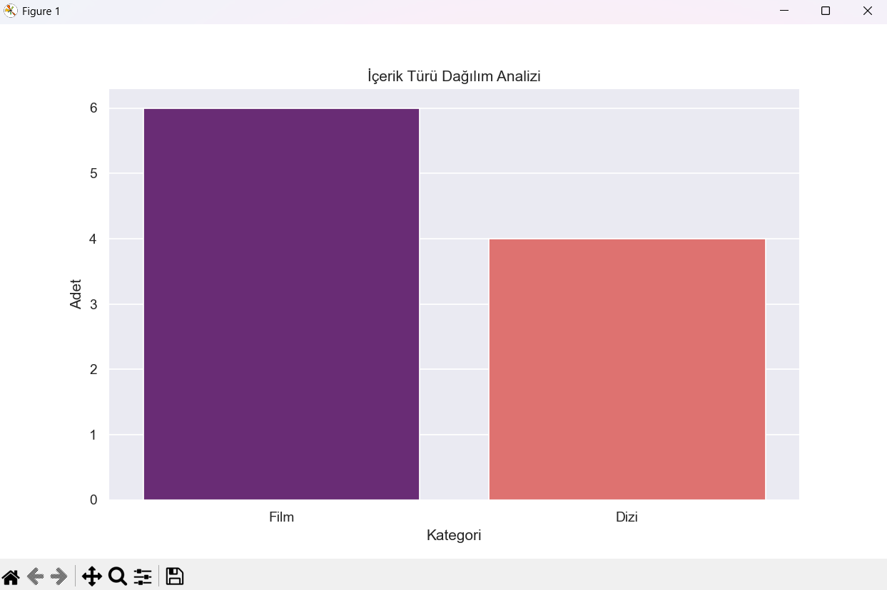

# 🚀 Automated File Organizer & Data Insight 📊


Bu proje, bir yazılım mühendisi adayı olarak geliştirdiğim, hem günlük hayatı kolaylaştıran bir **otomasyon** hem de verileri anlamlandıran bir **analiz** aracıdır.

## 🌟 Öne Çıkan Özellikler

### 📂 Akıllı Dosya Düzenleyici (`organizer.py`)
Masaüstündeki veya herhangi bir klasördeki karmaşaya son! 
- Dosya uzantılarını (`.jpg`, `.pdf`, `.mp4` vb.) otomatik tanır.
- Dosyaları türlerine göre ilgili klasörlere taşır.
- Temiz ve düzenli bir çalışma ortamı sağlar.

### 📈 Veri Analizi & Görselleştirme (`analysis.py`)
Verilerin gücünü kullanarak görsel sonuçlar üretir:
- **Pandas** ile veri manipülasyonu.
- **Seaborn** ve **Matplotlib** ile yüksek kaliteli grafik üretimi.
- İçerik türü dağılım analizi.

---

## 📸 Proje Çıktısı

Analiz modülü çalıştırıldığında elde edilen görsel sonuç:



---

## 🛠️ Kurulum ve Kullanım

1. Bu depoyu klonlayın:
   ```bash
   git clone [https://github.com/BirgulGokturk/Automated-File-Organizer.git](https://github.com/BirgulGokturk/Automated-File-Organizer.git)
